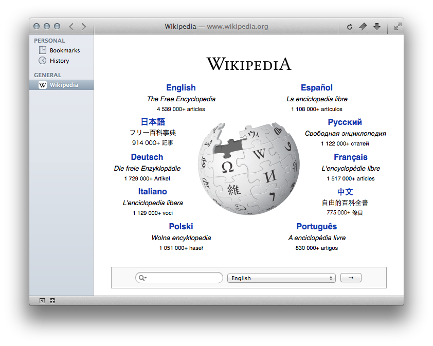

##Sapphire

###Description
Sapphire is a WebKit-based web browser for OS X 10.9 and above that focuses on providing power user features and a unique tab organization scheme alongside a sleek, modern UI. It's currently in its pre-alpha stage and is, for the time being, a hobby project.

###Planned Features
* Vertical "source list" tab organization, including support for groups, smart groups, and sticky groups
* Per-site settings, allowing Java, JavaScript, and web plugins to be enabled or disabled on a site-to-site basis
* Per-site customizations through user stylesheets and JavaScript
* HTML5 video and audio substitution in place of web plugins where possible'
* Multi-service bookmark and history syncing
* Robust, rule-based ad blocking
* Extended multitouch gesture support
* Flexible addon framework

...and more.

###Building Sapphire
CocoaPods is required for dependency management. See [The CocoaPods Website](http://cocoapods.org/) for details on how to install it.

1. Clone this repository
2. In the terminal, change directory to the newly cloned repository
3. Run `pod install`

This will install smaller dependencies. You will now need to provide a build of WebKit. Nightly builds are recommended, but the `WebKit.framework` bundled with OS X will work as well.

###Using Sapphire
Please note that Sapphire is far from complete and while it is functional enough for daily use, many features are missing or may work incorrectly. If you use it as your primary web browser, you are doing so at your own risk.

###License
Sapphire is licensed under [BSDv3](http://opensource.org/licenses/BSD-3-Clause). Contributions are welcome; simply fork, make your changes, and file a pull request.

###Donations
If you like Sapphire and want to support its development, please consider donating.

